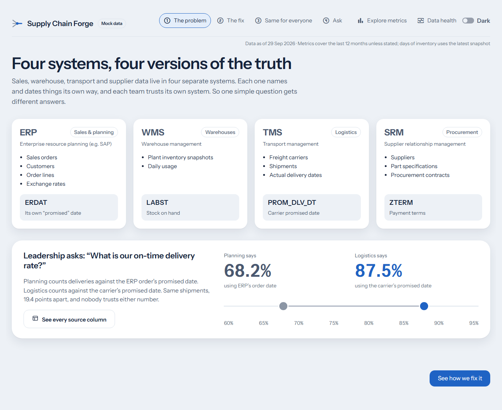
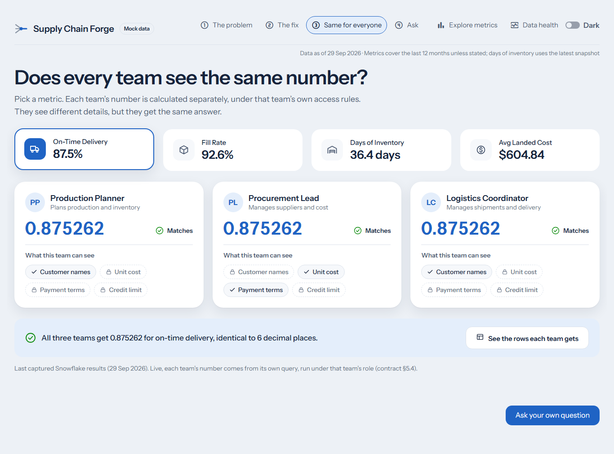
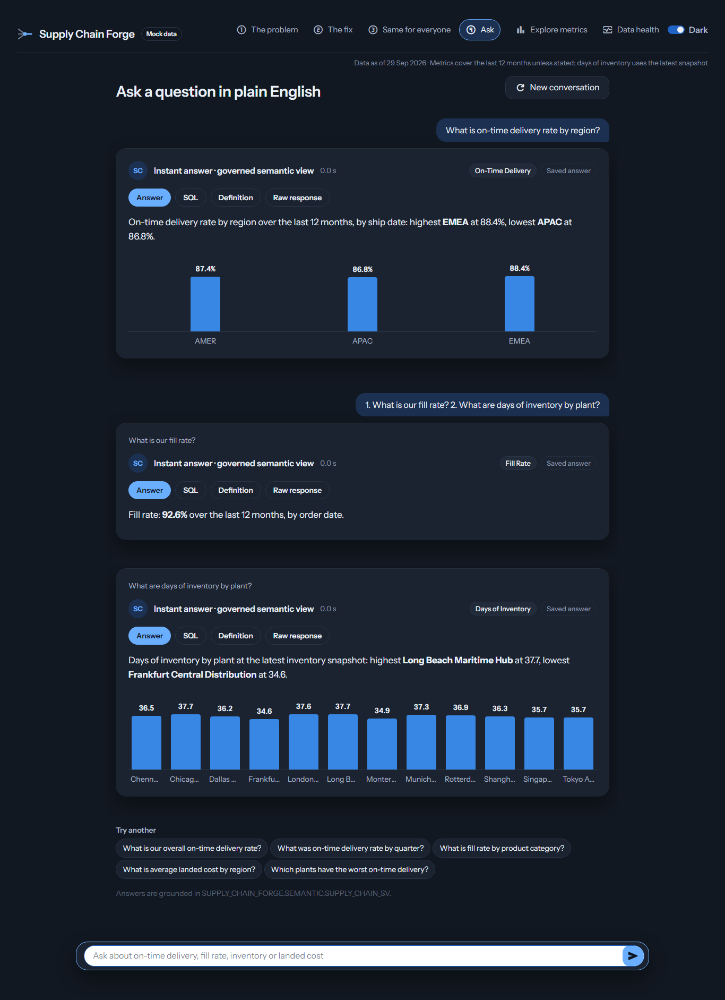
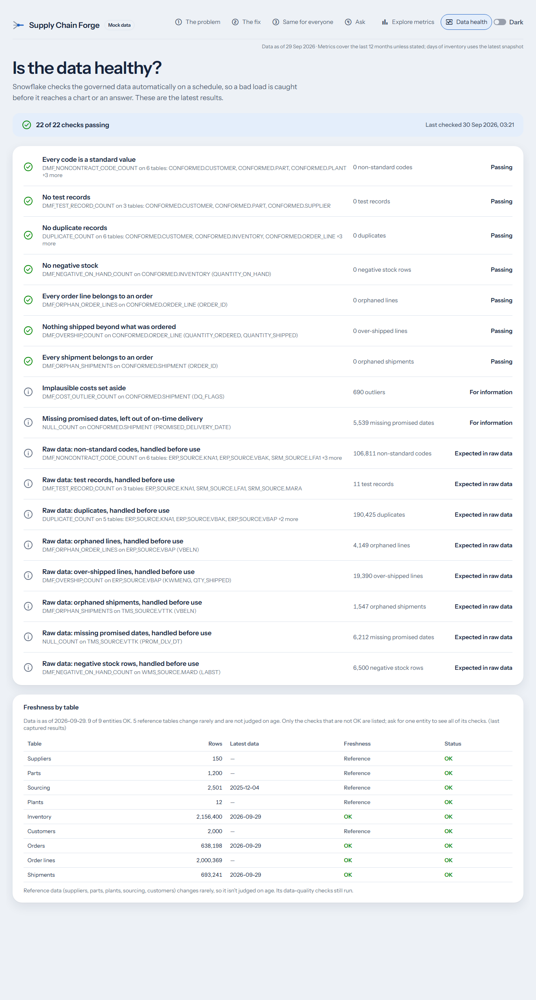
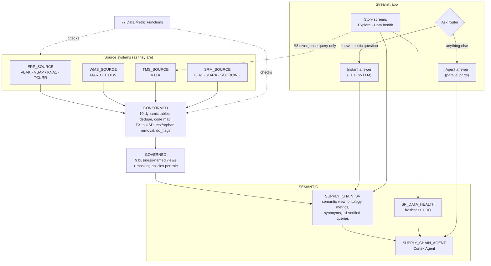

# Supply Chain Forge

**One governed number for every team.** A supply chain ontology, a governed semantic layer and a
conversational analytics app, built entirely in Snowflake.

[](https://github.com/Harsh2292/snowflake-forge/actions/workflows/tests.yml)


### ▶ Live app: **[supply-chain-forge.streamlit.app](https://supply-chain-forge.streamlit.app)**
Live on Snowflake, no login needed. If it has been idle, click "wake up" and give it a minute.

Built for the **Snowflake CoCo CLI Hackathon (GCC Edition)**, problem statement *Supply Chain
Ontology and Governed Conversational Analytics*.

---

## The problem

Supply chain data lives in four systems that don't agree with each other:

| System | Holds | Used by |
|---|---|---|
| **ERP** | sales orders, customers, order lines, exchange rates | Sales and planning |
| **WMS** | plant inventory snapshots, daily usage | Warehouses |
| **TMS** | shipments, carriers, actual and promised delivery dates | Logistics |
| **SRM** | suppliers, parts, sourcing contracts | Procurement |

Each system names and dates things its own way. When leadership asks *"What is our on-time
delivery rate?"*, Planning answers **68.2%**, because it counts deliveries against the ERP
order's date. Logistics answers **87.5%**, because it counts against the carrier's promised
date. It's the same shipments, 19.4 points apart, and nobody trusts either number.

## The fix

A **governed semantic layer** defines each business term once, in code. Every consumer
(people, dashboards, the AI agent) reads that one definition. The claim this project proves:

> **Planner, Buyer and Logistics get the same governed number, to 6 decimal places,
> while each sees differently masked details.**

<p align="center">
  
  
</p>
<p align="center">
  
  
</p>

<sub>The screenshots come from the browser test suite. They show the last captured Snowflake
results, so the header reads "Mock data"; live, it reads "Live".</sub>

---

## Contents

- [What's inside](#whats-inside)
- [Architecture](#architecture)
- [The canonical metrics](#the-canonical-metrics)
- [Governance: personas and masking](#governance-personas-and-masking)
- [Realistic, messy data](#realistic-messy-data)
- [Conversational analytics](#conversational-analytics)
- [Results](#results)
- [Repository layout](#repository-layout)
- [Getting started](#getting-started)
- [Building the Snowflake side](#building-the-snowflake-side)
- [Deployment](#deployment)
- [Testing](#testing)
- [Configuration](#configuration)
- [How this was built](#how-this-was-built)
- [Documentation](#documentation)
- [Limitations and roadmap](#limitations-and-roadmap)

---

## What's inside

- **Four messy source systems.** ERP, WMS, TMS and SRM schemas with SAP-style column names
  (`ERDAT`, `LABST`, `ZTERM`), a deterministic generator that produces ~725K orders, ~2.1M
  order lines and ~780K shipments over 10 years, and 19 kinds of injected real-world defects.
- **A cleaned `CONFORMED` layer.** Ten incremental dynamic tables de-duplicate, map codes,
  convert currencies, drop test and orphan records, and flag every repair.
- **A `GOVERNED` layer.** Nine business-named views, with masking policies per role and
  sensitivity tags.
- **The ontology as code.** One semantic view, `SUPPLY_CHAIN_SV`: 10 logical tables,
  12 relationships, 4 canonical metrics plus 15 supporting metrics, synonyms, AI instructions
  and 14 verified queries.
- **A Cortex Agent** on the semantic view, with a custom `data_health` tool.
- **Automated data quality.** 77 Data Metric Functions (7 of them custom) and a
  `SP_DATA_HEALTH` procedure that reports freshness and the as-of date.
- **A guided Streamlit app.** Four story steps (*The problem → The fix → Same for everyone →
  Ask*), two tools (*Explore metrics*, *Data health*), and light and dark themes.
- **Instant answers.** Known metric questions answer in about a second from the semantic view,
  with no LLM call. Everything else goes to the agent. Multi-part questions run their agent
  parts in parallel.
- **An evaluation set.** 30 questions run through `DATA_AGENT_RUN` and scored against ground
  truth: **28/30** in the event account.
- **A production-minded public link.** Key-pair service user, read-only role, warehouse and
  Cortex budgets, Ask rate limits, answer caching, a fallback banner, and a no-secrets CI check.
- **Nearly 900 tests.** Unit and contract tests, replays of real Snowflake output, live audits, and a
  real-browser suite, all run in CI.

## Architecture



| Layer | Schema | What it does |
|---|---|---|
| Source | `ERP_SOURCE`, `WMS_SOURCE`, `TMS_SOURCE`, `SRM_SOURCE` | Raw data exactly as each system produces it, defects included |
| Conformed | `CONFORMED` | Incremental dynamic tables apply the cleansing rules (`docs/DATA_SPEC.md` §4–§5); every repaired row carries `dq_flags` |
| Governed | `GOVERNED` | Business column names, the one authoritative promised date, masking policies, persona procedures |
| Semantic | `SEMANTIC` | The semantic view (the ontology), the Cortex Agent, and the data-health tool |
| App | `APP` / Community Cloud | The Streamlit app; it reads only the semantic view, the governed views, and the persona procedures |

Two design rules hold throughout:
- **The app never reads the source schemas.** The one exception is the contract §8 query that
  shows the naive ERP-date number on *The problem* screen.
- **The router never computes a number.** It only chooses between two governed paths over the
  same semantic view, and each answer card says which path answered.

## The canonical metrics

Each metric is defined once, in `SUPPLY_CHAIN_SV`. Without a stated period, each covers a
fixed default window (`docs/CONTRACT.md` §3a).

| Metric | Definition | Default window | Value* |
|---|---|---|---|
| **On-time delivery rate** | Delivered shipments arriving on or before the **TMS** promised date. In-transit shipments and shipments with no promised date are excluded | Shipped in the last 12 months | **87.5%** |
| **Fill rate** | Quantity shipped ÷ quantity ordered on shipped or delivered orders. Partial shipments are pro-rated; over-shipments count as fully shipped | Ordered in the last 12 months | **92.6%** |
| **Days of inventory** | Average on-hand ÷ average daily usage. Gross on-hand is used; negative on-hand counts as zero | The latest inventory snapshot | **36.4 days** |
| **Average landed cost** | Freight + duties + handling per shipment, in USD. Missing duty or handling counts as zero; unknown or implausible costs are excluded | Shipped in the last 12 months | **$604.84** |

<sub>*Captured 29 Sep 2026. The data is deterministic and was re-verified byte-identical
after the move to the event account. The window moves with `CURRENT_DATE()`, so the values
drift slightly day to day.</sub>

The metrics can be broken down by plant, region, country, plant type, part category and
subcategory, customer segment and region, order date, month, quarter, year, status and
priority, carrier, and shipment status. Only the pairings the data model can answer
correctly are allowed. For example, on-time delivery by part category is refused because a
shipment can hold many parts (`docs/CONTRACT.md` §4).

## Governance: personas and masking

Three business roles query the same governed views. Masking policies on the governed columns
decide what each role sees, and sensitivity tags classify every column at the source.

| Column | Production Planner | Procurement Lead (Buyer) | Logistics Coordinator |
|---|---|---|---|
| Part unit cost | hidden | ✅ visible | hidden |
| Sourcing contract price | hidden | ✅ visible | hidden |
| Supplier payment terms | `*** RESTRICTED ***` | ✅ visible | `*** RESTRICTED ***` |
| Customer name and email | ✅ visible | `*** MASKED ***` | ✅ visible |
| Customer credit limit | hidden | hidden | hidden |
| **All four metrics** | **identical** | **identical** | **identical** |

The consistency proof runs each metric as each role through owner's-rights persona procedures
(`SP_METRICS_AS_*`, `SP_SAMPLE_AS_*`). The values match to 6 decimal places, while the sample
rows show each role's masking (`docs/CONTRACT.md` §5.4–§6a).

## Realistic, messy data

`data_gen/` is a seeded, deterministic Snowflake Scripting generator (seed `20260929`, end
date `2026-09-30`). It writes the four source systems in foreign-key order, with seasonality,
order lifecycles, carrier churn, currencies and inventory dynamics. It scales with
`SCALE_FACTOR`; the default is SF 1.

| Source table | Rows (SF 1, with defects) | After cleansing (`CONFORMED`) |
|---|---|---|
| Orders (`VBAK`) | 724,949 | 638,198 |
| Order lines (`VBAP`) | 2,074,071 | 2,000,369 |
| Shipments (`VTTK`) | 780,439 | 693,241 |
| Inventory snapshots (`MARD`) | 2,167,092 | 2,156,400 |
| Customers · Suppliers · Parts · Plants | 2,025 · 152 · 1,204 · 12 | 2,000 · 150 · 1,200 · 12 |

A separate procedure then injects the **mess catalogue** (`docs/DATA_SPEC.md` §4):

- **Repairable defects:** re-sent duplicates, out-of-date status versions, code variants
  (`Apac`, `ASIA-PAC`, `DHL Express`, `CNL`), test and dummy records, non-USD amounts, late
  arrivals, and ID whitespace or case problems.
- **Business-rule edge cases:** missing promised dates, orders cancelled after shipping, return
  orders, over-shipments, negative on-hand, zero usage, null or outlier costs, orphan rows,
  ERP/TMS date conflicts, duplicate primary suppliers, and future-dated orders.

Every defect has a cleansing rule in `CONFORMED`, and a Data Metric Function proves it's gone.

## Conversational analytics

**The Cortex Agent** (`agent/01_agent.sql`, orchestration model `claude-sonnet-4-5`) has two
tools:
- `supply_chain_analyst`: Cortex Analyst on `SUPPLY_CHAIN_SV`
- `data_health`: a custom tool backed by `SP_DATA_HEALTH`

Its instructions cover the time rule, refusing masked data and impossible breakdowns, asking
when a question is ambiguous, and answering numbered multi-part questions in order.

**The Ask router** (`app/utils/router.py`) sits in front of the agent:

1. **Instant answers.** A question that names one canonical metric, at most one valid
   breakdown or one value, and nothing else ("What is fill rate by region?", "OTD for enterprise
   customers", "Which plants have the worst on-time delivery?") runs the verified queries' own
   SQL on the semantic view. It returns in about a second, with no LLM call and no Cortex cost.
   - The router's vocabulary is **generated from the semantic view itself**: names, aliases,
     synonyms and table synonyms (`tests/tools/build_vocabulary.py` → `app/utils/vocabulary.json`).
     A synonym added to the view becomes a phrase the app understands.
   - Plant and carrier names are learned from the view's own results, and small typos are
     forgiven.
   - Any word it doesn't understand (a time period, a number, "why", an unknown name) sends the
     question to the agent instead.
2. **Multi-part questions** are split on clear boundaries: numbered parts, `;`, back-to-back
   questions, or "A and B". Their agent parts run in parallel.
3. **The agent** answers everything else. The card shows its SQL, the metric definitions, the
   tools used, and its follow-up suggestions.

**Guards on the public link:** an answer cache, per-visitor and global rate limits, a
statement timeout, a warehouse resource monitor, and a monthly Cortex budget. When the agent is
refused (budget used up, or the service unavailable), Ask says *"Ask is paused"* for ten
minutes while instant answers keep working. Two honest limits: Snowflake's budget figures lag
actual use by up to about six hours, so spend can overshoot the cap a little before the
agent is switched off; and the app's rate-limit counters live in the app process, so they reset
when the app restarts.

## Results

| What was checked | Result | Evidence |
|---|---|---|
| Same metric across the three personas | Identical to 6 decimal places, with different masking | `docs/artifacts/09_consistency_proof.json` |
| Naive ERP-date OTD vs. governed OTD | 68.2% vs. **87.5%** on the same shipments | `docs/artifacts/runs/B08c_run.md` |
| Agent evaluation (30 questions: canonical, lookups, counts, multi-part, out-of-scope, ambiguous, Hindi, data health, cross-grain) | **28/30**, p50 latency 12.3 s (baseline 27/30, 17.7 s) | `docs/artifacts/08_agent_answers.md`, `runs/B08m_run.md` |
| Instant answers vs. the agent's verified queries | The same SQL, text for text; 0 false shortcuts on the 30 evaluation questions | `tests/unit/test_router.py` |
| Data-quality self-checks | **93/93 TRUE**; 77 DMFs attached and producing results | `docs/artifacts/runs/C16_run.md` |
| Rebuild from the repo into a new account | Every object replayed with no hand fix; source data byte-identical (`HASH_AGG` on all 10 tables) | `docs/artifacts/runs/B08m_run.md` |

## Repository layout

```
snowflake-forge/
├── app/                      Streamlit app (the only dependency file in app/ is requirements.txt)
│   ├── streamlit_app.py      entry point: header, story navigation, fallback banner
│   ├── ui/                   screens, payload builders, theme, self-contained HTML views
│   └── utils/
│       ├── forge_data.py     the ONLY module that talks to Snowflake (mock + live branch each)
│       ├── router.py         Ask router: instant answers, multi-part split, parallel agent parts
│       ├── agent_response.py DATA_AGENT_RUN response parser
│       ├── ask_guard.py      public-link cost guards: limits, answer cache, pause
│       ├── config.py         contract constants, copied verbatim from docs/CONTRACT.md
│       ├── captured.json     the last captured Snowflake results (mock mode and fallback)
│       └── vocabulary.json   router vocabulary, generated from the semantic view
├── sql/
│   ├── 01_setup/             database, warehouse, roles, schemas
│   ├── 02_tables/            source DDL (05_source_v2.sql is current; 01–04 are the v1 build)
│   ├── 03_sample_data/       v1 sample data (superseded by data_gen/)
│   ├── 04_governance/        tags, masking, CONFORMED layer, governed views, persona procedures
│   ├── 05_app_access/        app service user and role, resource monitor, Cortex budget
│   └── replay_helper.py      runs the repo's SQL files into an account
├── data_gen/                 seeded source-data generator + mess injection + self-checks
├── semantic/                 the semantic view (ontology, metrics, verified queries)
├── agent/                    the Cortex Agent
├── quality/                  custom DMFs, DMF attachment, SP_DATA_HEALTH, DQ self-checks
├── eval/                     30-question agent evaluation set and runner
├── tests/                    unit, contract, replay, live, governance, semantic, UI, scale
├── deploy/                   RUNBOOK.md, deploy_app.py (Streamlit in Snowflake), sis/
├── demo/                     demo script
├── docs/                     contract, design docs, data spec, captured artifacts, references
├── assets/screenshots/       README images
└── .github/workflows/        CI tests + keep-awake for the public app
```

## Getting started

### Run the app locally (no Snowflake needed)

The app runs on the last captured Snowflake results when it has no connection.

```bash
git clone https://github.com/Harsh2292/snowflake-forge.git
cd snowflake-forge
python -m venv .venv
# Windows: .venv\Scripts\activate      macOS/Linux: source .venv/bin/activate
pip install -r app/requirements.txt
cd app
streamlit run streamlit_app.py
```

The header tag reads **Mock data**. Every screen works, and Ask answers the suggested and
instant questions.

### Run it live on Snowflake

The app switches to live mode by itself when it finds a Snowflake connection:

- **Secrets (as on the public link):** copy `.streamlit/secrets.toml.example` to
  `.streamlit/secrets.toml`, fill in the key-pair connection (`deploy/RUNBOOK.md` §1–§3), and
  run `streamlit run app/streamlit_app.py` from the repo root.
- **A named connection (development):** set `SNOWFLAKE_CONNECTION_NAME` to a connection in your
  `connections.toml`, then run from `app/`.
- **Streamlit in Snowflake:** the active session is picked up automatically.

The header tag then reads **Live**. If Snowflake becomes unreachable, a banner says so and the
screen falls back to the saved results.

## Building the Snowflake side

The whole build replays from this repo; nothing was built by hand. Run the files in this order,
with the role named in each file's header (`ACCOUNTADMIN` for setup and DMF attachment,
`FORGE_ADMIN` otherwise). `sql/replay_helper.py` automates it.

| # | Files | Result |
|---|---|---|
| 1 | `sql/01_setup/01_database.sql`, `02_roles_grants.sql`, `03_schemas_v2.sql` | Database, `FORGE_WH`, roles, 9 schemas |
| 2 | `sql/02_tables/05_source_v2.sql` | 10 source tables |
| 3 | `data_gen/00` → `10` → `20` → `30`, then `data_gen/99_run.sql` | Generated source data at SF 1 with the mess injected (seed `20260929`, end date `'2026-09-30'`) |
| 4 | `sql/04_governance/01`, `02`, `06`, `03`, `04`, `05` | Tags, masking policies, `CONFORMED`, governed views, persona procedures |
| 5 | `semantic/01_semantic_view.sql` | `SUPPLY_CHAIN_SV` |
| 6 | `quality/00` → `40`, then `quality/99_run.sql` | DMFs attached, `SP_DATA_HEALTH`, self-checks |
| 7 | `agent/01_agent.sql` | `SUPPLY_CHAIN_AGENT` |
| 8 | `eval/00` → `30`, then `eval/99_run.sql` | Evaluation set and a scored run |
| 9 | `sql/05_app_access/01_app_service_user.sql`, `02_cost_controls.sql` | `FORGE_APP_ROLE`, `FORGE_APP_SVC`, resource monitor, Cortex budget |

Generating SF 1 takes a few minutes on an XS warehouse (up to ~15 on a brand-new account). `tests/scale/` holds the scale
harness for 100M+ order lines on a clone.

## Deployment

**The public link is Streamlit Community Cloud** (`deploy/RUNBOOK.md`):
1. Generate a key pair outside the repo.
2. Set the public key on `FORGE_APP_SVC`.
3. Create the app with entrypoint `app/streamlit_app.py` and Python 3.11.
4. Paste the secrets.
5. Check it in a private window.

`keep_awake.yml` opens every screen on a schedule, so the app doesn't sleep.

**The fallback is Streamlit in Snowflake.** `python deploy/deploy_app.py` uploads `app/` and
(re)creates the app. Use `--dry-run` to see the files and SQL without connecting. SiS reads
`deploy/sis/environment.yml`; keep its Streamlit pin (1.52.2) in step with
`app/requirements.txt`.

Moving to a new account changes only the secrets (RUNBOOK §7).

## Testing

```bash
pip install -r tests/requirements.txt
python -m pytest -q            # unit + contract + replay tests on saved data (~10 s)
python -m pytest -m live -q    # live contract audit against Snowflake (needs SNOWFLAKE_CONNECTION_NAME)
python -m playwright install chromium
python -m pytest -m ui -q      # every screen in a real browser, light and dark (~90 s)
```

| Suite | Count | What it proves |
|---|---|---|
| Unit and contract (`pytest -q`) | 725 | Every function and contract rule on saved data; the router against all 30 evaluation questions; no secrets in the repo |
| Replay (`tests/artifacts/`) | in the above | The *live* code path, fed the real rows and agent responses captured from Snowflake |
| Live audit (`-m live`) | 148 | Every contract section against real Snowflake, with a per-section summary |
| Browser (`-m ui`) | 26 | Every screen in Chromium, light and dark, three widths; in-view interactions; screenshots |

CI (`.github/workflows/tests.yml`) runs the unit and browser suites on every push. Contract
tests run in both `[mock]` and `[live]` modes; in live mode, a fallback to saved data fails
the test.

## Configuration

App settings live in the `[forge]` section of the Streamlit secrets, so they change without
a commit. Defaults are in `app/utils/config.py`.

| Key | Default | Effect |
|---|---|---|
| `mode` | `live` when a connection exists | `"mock"` forces the saved results |
| `shortcut` | `true` | `false` turns off instant answers; every question goes to the agent |
| `stream` | `true` | `false` stops streaming agent answers (REST `agent:run`); `DATA_AGENT_RUN` answers instead |
| `cooldown_seconds` | 10 | Per visitor, the gap between two agent calls |
| `per_session` | 10 | Agent calls per visitor session |
| `concurrent` | 3 | Agent calls running at once, all visitors |
| `per_hour` / `per_day` | 30 / 200 | Agent calls per rolling hour / per UTC day, all visitors |

After any change to `semantic/01_semantic_view.sql`, run
`python tests/tools/build_vocabulary.py`; a test fails until you do. After CoCo re-captures
artifacts, run `python tests/tools/build_captured.py`.

## How this was built

Two AI coding agents built the project, coordinated by a human, against one frozen interface
contract:

- **CoCo** (Snowflake Cortex Code CLI) built and ran everything in Snowflake: the schemas,
  `CONFORMED`, governance, the semantic view, the agent, the DMFs and the cost controls.
  Entry point: `COCO.md`.
- **Claude Code** built the app, the tests, the deploy tooling and the docs. It also wrote the
  generator, quality and evaluation SQL, which CoCo ran through a **handoff lock** (Claude Code
  never had Snowflake credentials).
- **`docs/CONTRACT.md`** is the arbiter. It fixes every object name, metric, dimension pairing,
  masking rule and query pattern. Any deviation is filed as a change request (§11). Real
  Snowflake output is captured into `docs/artifacts/`, and the app is tested against it.

Coordination files are in `.agents/`: `NEXT.md` (what's next), `HANDOFF.md` (messages and the
handoff lock), and `tasks/` (one card per track, with its gate).

## Documentation

| Document | What's in it |
|---|---|
| [`docs/CONTRACT.md`](docs/CONTRACT.md) | The interface contract: names, metrics, pairings, masking, query patterns, change requests |
| [`docs/HLD.md`](docs/HLD.md) · [`docs/LLD.md`](docs/LLD.md) | High- and low-level design |
| [`docs/DATA_SPEC.md`](docs/DATA_SPEC.md) | Source DDL, volumes, realism, the mess catalogue, cleansing and time rules |
| [`docs/artifacts/`](docs/artifacts/) | Real Snowflake output and run reports for every build step |
| [`deploy/RUNBOOK.md`](deploy/RUNBOOK.md) | Public link setup, checks, cutover, judging-day checklist |
| [`demo/demo_script.md`](demo/demo_script.md) | The demo walkthrough |
| [`docs/ROADMAP.md`](docs/ROADMAP.md) | What comes after the hackathon |
| [`docs/references/`](docs/references/) | Snowflake and Streamlit API notes used while building |

## Limitations and roadmap

- **Synthetic data.** The four systems are generated, realistically and deterministically. Real
  connectors to SAP and other source systems are the first roadmap item.
- **Four canonical metrics.** The semantic view holds 15 more (revenue, counts, lead time,
  transit time); the agent answers those, but the instant path covers only the four contract
  metrics.
- **Instant answers are rule-based on purpose.** They cover known metric questions; the agent
  answers anything with a period, a comparison or free text.
- **Agent latency.** Agent answers take about 12 s at p50 and 36.5 s at p95, mostly
  orchestration time. Single-question answers stream as they are written (CR-008), with a
  Stop button, so the wait is visible rather than blank.

See [`docs/ROADMAP.md`](docs/ROADMAP.md) for configurable metric definitions, enterprise
identity, packaging, and production-scale operations.
